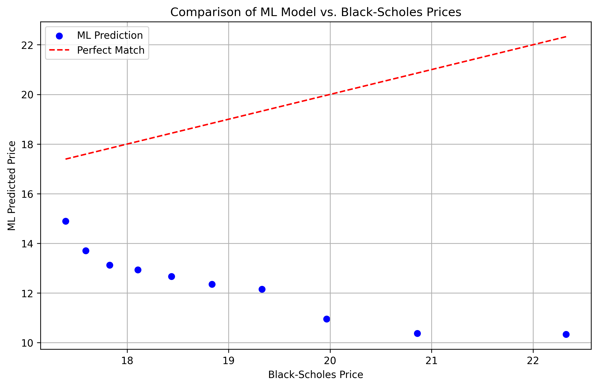

# Applied Machine Learning in Financial Derivatives

## Overview
This project combines the Black–Scholes option pricing with a machine learning model to estimate European call option prices and visualise portfolio performance.  
It demonstrates how ML can approximate pricing functions relative to traditional closed-form solutions, and how portfolio composition can be evaluated through option pricing.

---

## Analysis
There was systematic underestimation by ML. Across all strike prices and maturities, the ML model consistently underpredicts call option prices compared to Black-Scholes, with the difference decreasing as strike price and maturity increase.

Accuracy improves for longer maturities. The discrepancy between BS and ML decreases for options with longer maturities, indicating that the ML model captures long-term trends better than short-term price sensitivities.

Using the estimated volatility (≈0.26) and spot price ($207.33), the total portfolio value is $504.89. This demonstrates that despite the ML model’s individual pricing differences, it can still provide reasonable aggregate portfolio valuations.

---

## Methodology

**Data**  
- Historical stock data (closing prices).  
- Volatility estimated using log returns.  

**Models**  
- Black–Scholes formula as the benchmark for option pricing.  
- Random Forest Regressor trained on Monte Carlo–simulated option prices using:  
  - Spot price (S)  
  - Strike price (K)  
  - Time to maturity (T)  

**Comparisons**  
- Side-by-side results of Black–Scholes vs ML predictions.  
- Scatter plot illustrating where the ML model diverges from Black–Scholes.  

**Portfolio Analysis**  
- Constructed a sample options portfolio.  
- Portfolio valued using Black–Scholes pricing.  
- Bar chart showing contribution of different options.  

---

## Sample Results

**Black–Scholes vs ML Predictions**  

The red dashed line represents perfect agreement. Deviations show areas where the ML model underestimates or overestimates prices compared to Black–Scholes.  

**Portfolio Contributions**  

The bar chart shows how different strikes and maturities contribute to the overall portfolio value. 

---

## How to Navigate
- `BS.py` – Black–Scholes implementation  
- `ml_model.py` – Machine learning training script  
- `comparison_set.py` – Comparison of BS vs ML predictions, generates scatter plot  
- `portfolio.py` – Builds sample portfolio, generates bar chart  
- `data/` – Historical stock data (CSV)  
- `results/` – Generated plots (PNG)  

---

## Future Improvements
I could train ML models on larger, real market datasets. Or test additional regressors like XGBoost and Neural Networks. 
